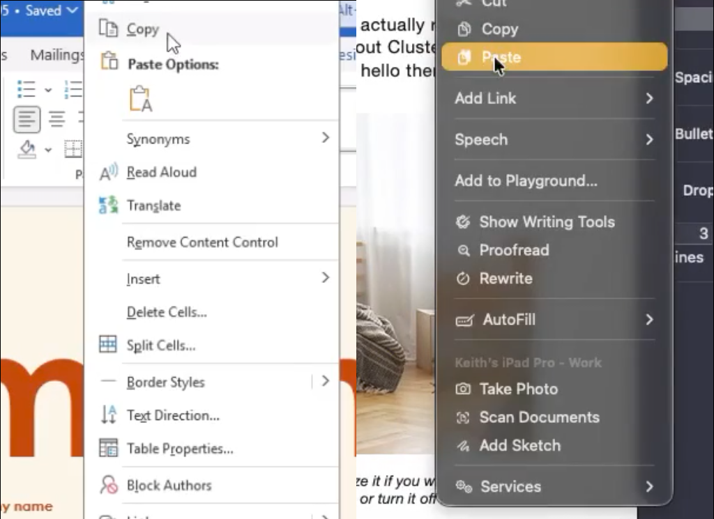
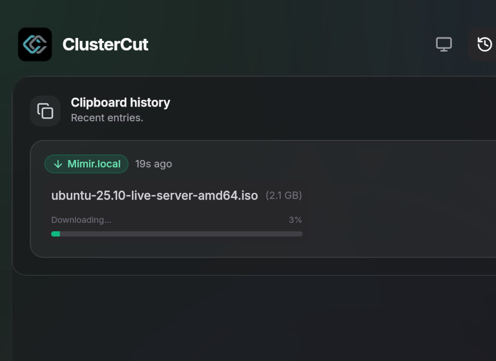
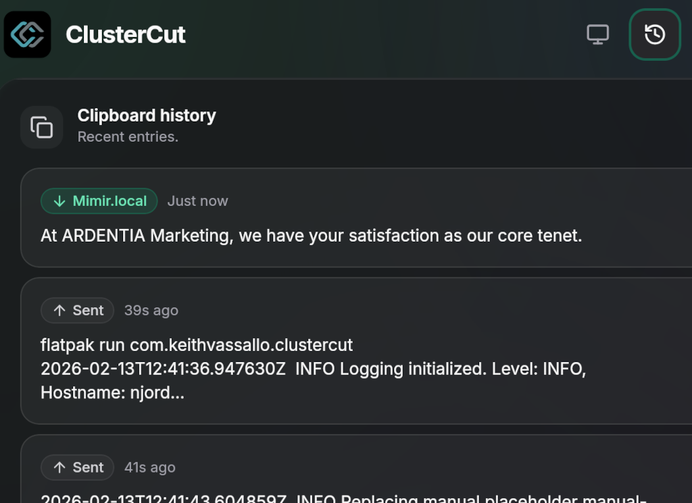
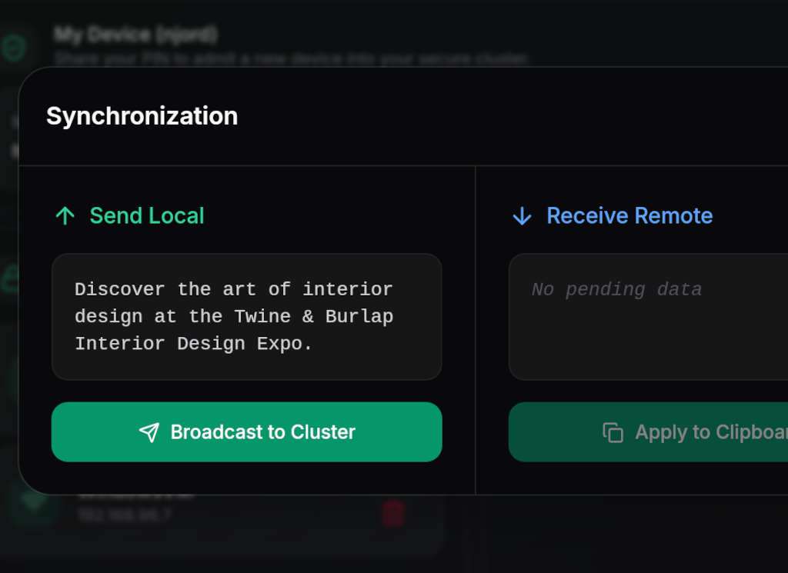
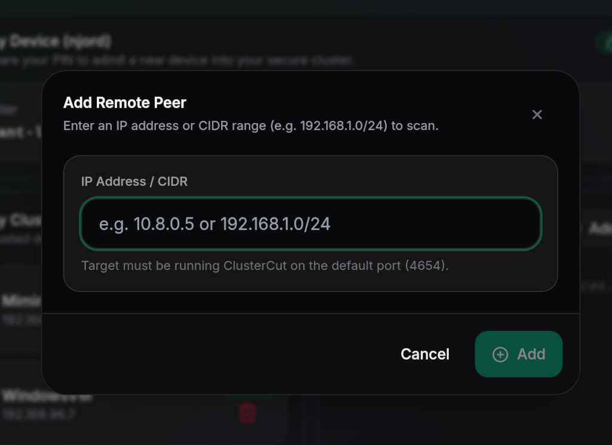

<p align="center">
  
</p>

# ClusterCut

> **Sync your clipboard, securely & locally.**

ClusterCut keeps your clipboard in sync across Windows, macOS, and Linux without your data ever leaving your local network. No clouds, no accounts, just seamless productivity.

<video autoplay="autoplay" mute src="https://github.com/user-attachments/assets/6aa1297b-a55a-49bc-a33e-059e680231ac"></video>

> [!NOTE]
>  <br>
> This project voluntarily adheres to The Friendly Manifesto. Read more [here](https://friendlymanifesto.org)

## Features

### Seamless Clipboard Sync
Copy text on one device and paste it on another instantly, without any extra interactions. It just works.

<p align="center">
  
</p>

### Smart File Transfers
ClusterCut handles files intelligently. Small files are sent automatically—just copy and paste. For larger files, you'll receive a notification to download them when you're ready.

<p align="center">
  
</p>

### Clipboard History
Never lose a clip again. ClusterCut automatically saves your clipboard history, so you can access and paste previous items whenever you need them.

<p align="center">
  
</p>

### Manual Mode
Don't want to automatically send or receive everything? Enable manual mode to be in full control of your data flow.

<p align="center">
  
</p>

### Works Remotely
Your cluster isn't limited to one network. Manually add remote clusters to sync over a VPN or the internet securely.

<p align="center">
  
</p>

---

## Built for Privacy & Speed

| Feature | Description |
| :--- | :--- |
| **End-to-End Encryption** | Your clipboard content is encrypted before it leaves your device. Only your trusted devices can read it. |
| **Lightning Fast** | Built with Rust and optimized for local networks. Copy on one device, paste on another instantly. |
| **Cross-Platform** | Native experience on macOS, Windows, and Linux. Your clipboard works everywhere you do. |
| **Local Network Only** | No servers, no cloud, no internet required. Your data stays within your four walls. |
| **Zero Knowledge** | We don't collect data, telemetrics, or logs. Your privacy is our top priority. |
| **Open Source** | ClusterCut is fully open source. Inspect the code, contribute, or build it yourself. |

---

## Development

### Prerequisites

- **Rust & Cargo**: [Install Rust](https://www.rust-lang.org/tools/install)
- **Node.js** (v18+): [Install Node.js](https://nodejs.org/)
- **Just**: `cargo install just` (or via your package manager)
- **Tauri Prerequisites**: Follow the [Tauri v2 System Dependencies](https://v2.tauri.app/start/prerequisites/) guide for your OS.
  - **Linux (Debian/Ubuntu)**: `libwebkit2gtk-4.1-dev build-essential libssl-dev libgtk-3-dev libayatana-appindicator3-dev librsvg2-dev`
  - **Linux (Fedora/RHEL)**: `webkit2gtk4.1-devel openssl-devel gtk3-devel libappindicator-gtk3-devel librsvg2-devel`

### Setup

1. **Clone the repository**:
   ```bash
   git clone https://github.com/keithvassallomt/ClusterCut.git
   cd ClusterCut
   ```

2. **Install dependencies**:
   ```bash
   npm install
   ```

### Running Locally

To start the development server with hot-reload:

```bash
npm run tauri dev
```

### Building

We use a [Justfile](Justfile) for all build workflows (requires [just](https://github.com/casey/just)):

```bash
just build          # Build native package (.exe/.dmg/.deb/.rpm)
just flatpak        # Build and install a local Flatpak from working tree
just run-flatpak    # Run the locally-installed Flatpak
just extension-zip  # Build the GNOME extension ZIP
just release        # Full release: version sync, tag, push, build everything
just clean          # Clean all build artifacts
```

See [BUILD.md](BUILD.md) for detailed build instructions, Flatpak setup, GNOME extension installation, and the release workflow.

### Clipboard Architecture (Linux)

On Linux, ClusterCut uses a three-path clipboard backend:

| Environment | Backend |
| :--- | :--- |
| **X11** | `tauri-plugin-clipboard` (same as Windows/macOS) |
| **Wayland + KDE/Sway/Hyprland** | `wl-clipboard-rs` via `wlr-data-control` |
| **Wayland + GNOME** | ClusterCut GNOME extension (clipboard bridging over D-Bus) |

The backend is detected automatically at startup. On GNOME Wayland, the [ClusterCut extension](https://extensions.gnome.org/extension/9341/clustercut/) is required for clipboard sync to function.

### Recommended IDE Setup

- [VS Code](https://code.visualstudio.com/) + [Tauri](https://marketplace.visualstudio.com/items?itemName=tauri-apps.tauri-vscode) + [rust-analyzer](https://marketplace.visualstudio.com/items?itemName=rust-lang.rust-analyzer)
